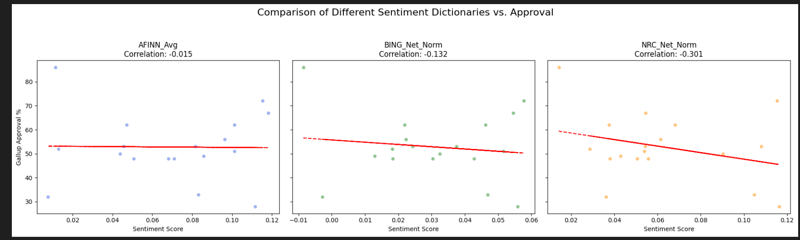
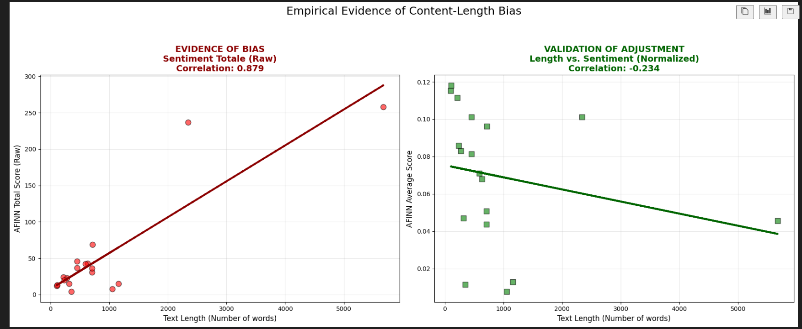

# Sentiment Analysis of political texts: A Replication Study

### Project Overview
This project performs a computational analysis of **US Presidential Speeches** (from Truman to Obama) to evaluate the reliability of automated sentiment analysis tools within political science.

The study serves as a **methodological replication** of the critical framework proposed by *Chan et al. (2021)*. The primary objective is to test the predictive validity of sentiment dictionaries against real-world public opinion (**Gallup Approval Ratings**) and to demonstrate the necessity of normalization to avoid the **"Content-Length Bias"**.

---

### Research Objectives
1.  **Analyze Predictive Validity:** Determine if the sentiment of a speech (normalized for length) correlates with Presidential Approval ratings.
2.  **Methodological Verification:** Prove empirically that "Raw Scores" are flawed because they measure verbosity rather than emotion, validating the decision to use normalized data. 

---

### 🛠 Methodology & Workflow

The analysis was conducted using **Python** (Pandas, Matplotlib, NumPy) and followed this specific execution order:

#### 1. Normalization & Predictive Analysis (The Main Approach)
We first calculated the **Normalized Sentiment Score** (Density) for every speech by dividing the total dictionary score by the word count.
* These corrected scores were then merged with historical **Gallup Polls** (using *nearest-date alignment*) to analyze the relationship between rhetorical tone and public approval.

#### 2. Robustness Check (Bias Verification)
To validate our choice of using normalized data, we performed a comparative analysis:
* We plotted the **Normalized Scores** against Speech Length (Word Count).
* We plotted the **Raw Scores** (un-normalized) against Speech Length.
* **Goal:** To demonstrate that without normalization, the data is statistically biased by the length of the text.

---

### Key Findings

#### 1. The "Null" Result (Sentiment vs. Approval)
Comparing the **Normalized Sentiment** (the correct metric) with Presidential Approval, the analysis revealed **no significant correlation**.

* **AFINN Correlation:** $r \approx -0.015$ (Statistically zero).
* **BING Correlation:** $r \approx -0.13$ (Weak negative correlation).
* **NRC Correlation:** $r \approx -0.30$ (Negative correlation).

This result suggests that generic "off-the-shelf" dictionaries fail to predict public opinion. A speech classified as "positive" by the algorithm does not correspond to an increase in approval ratings.

#### 2. Confirmation of "Content-Length Bias" (Methodological Validation)
Our retrospective check confirmed why normalization was strictly necessary.
* **Raw Scores (Red):** Showed a strong positive correlation with speech length. The code was measuring *how much* a President spoke, not *how* they spoke.
* **Normalized Scores (Green):** Showed independence from speech length, confirming the validity of our main metric.

---

### 📂 Repository Structure

│───README.md
│───Replication_of_a_case_study.txt
│───Sentiment_analysis.ipynb
│
├───Data
│   ├───Approval
│   └───Presidents_texts
│
├───downloaded_lexica
├───exam-instructions
└───Results

